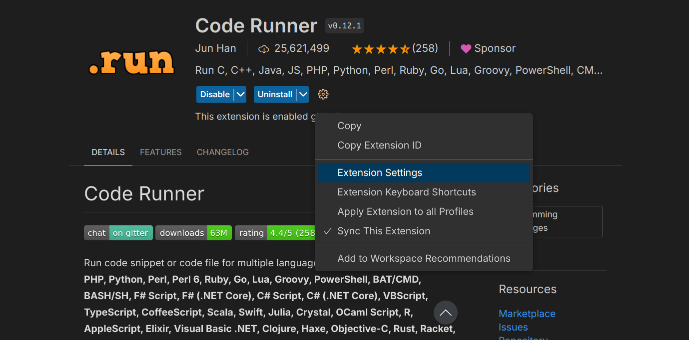
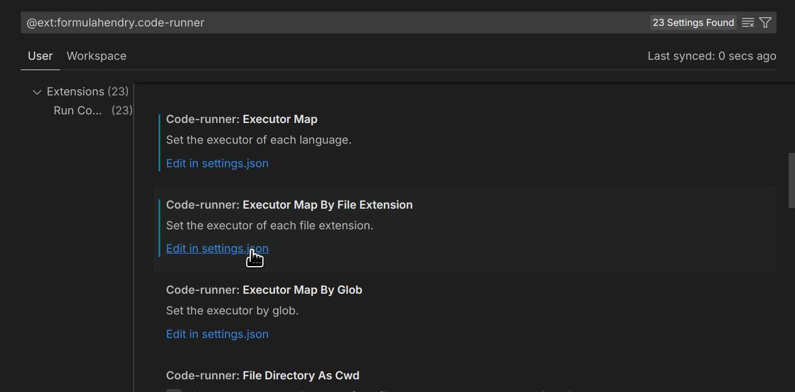
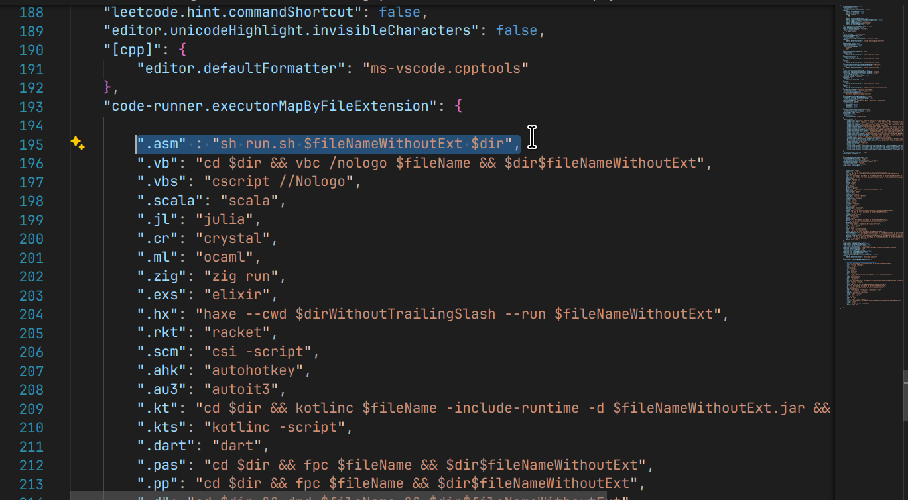

## Code Runner Support 
Tired of typing the same command again and again. Code Runner gives one click execute support for better accessibility, make sure you have the [Code Runner](https://marketplace.visualstudio.com/items?itemName=formulahendry.code-runner) extenstion installed. Then follow the steps given below.

**Note:** You can only run this in easy-masm folder, it will not work dynamically work everywhere. 

**Note:** This method will make the ``` ./run.sh filename ``` method obsolete, see step three to make both steps accessible at the same time.

### 1. Change Extension Settings
Click on extension settings of the code runner extension.

  

then goto goto the following file "Executer Map by File Extension"

   
then add the following lines here. 

Linux & MacOS: ``` ".asm" : "sh run.sh $fileNameWithoutExt $dir" ```

Windows: ```".asm" : "./run.bat $fileNameWithoutExt $dir"```

   

### 2. You can then change your ```run.sh``` or  ```run.bat``` to the following:

Linux and MacOS
 ``` 
#!/bin/sh
cp "$2$1.asm" lib 
cd lib 
wine aml.exe /c /Zd /coff $1.asm 
wine alink.exe /SUBSYSTEM:CONSOLE $1.obj 
wine $1.exe 
rm $1.exe 
rm $1.obj 
rm $1.asm 
cd ..
 ``` 

 Windows
 ``` 
 copy %2\%1.asm lib\ && ^
cd lib && ^
aml.exe /c /Zd /coff %1.asm && ^
alink.exe /SUBSYSTEM:CONSOLE %1.obj && ^
%1.exe && ^
del %1.exe && ^
del %1.obj && ^
del %1.asm && ^
cd ..
  ```
It should work now!!!!

### 3. (Optional) 
You can also make a newfile called ```coderunner.sh``` and put your the above code there & put the Linux/MacOS: ``` ".asm" : "sh coderunner.sh $fileNameWithoutExt $dir"``` or WIndows: ```".asm" : "./run.bat $fileNameWithoutExt $dir"```in the code runner settings.
